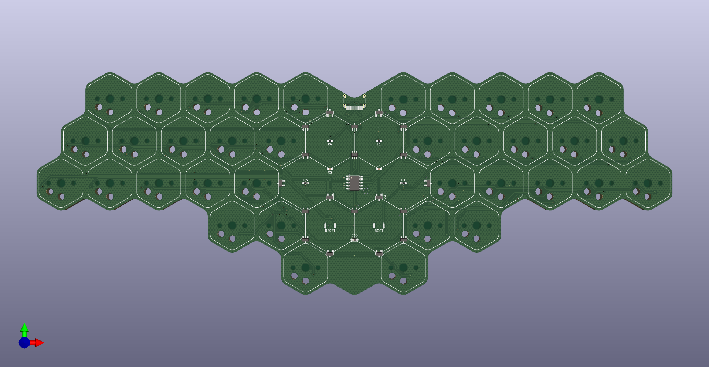
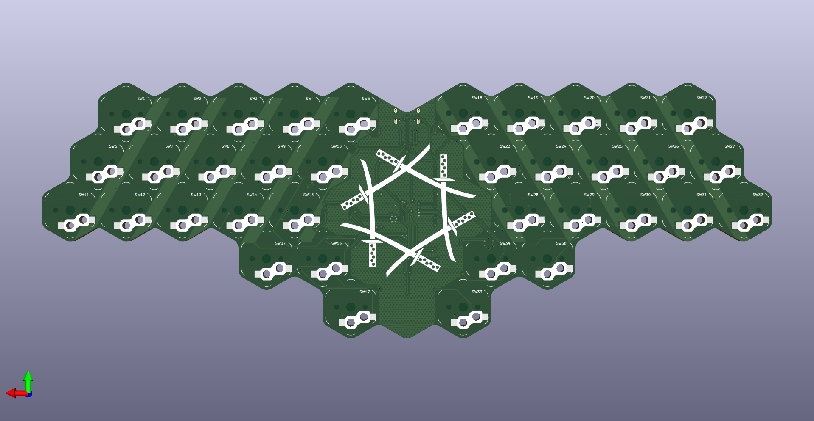

# Hexatana
Hexatana is a 36 katana-inspired keyboard designed around [hexagonal keycaps](https://github.com/kilipan/miao).
It uses the CH552T controller and [FAK firmware](https://github.com/semickolon/fak).

The electronic design is derived from the [MIAO MCU board](https://github.com/kilipan/miao).
